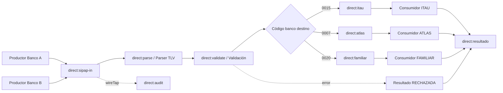

# Integración de transferencias SIP/QR con Apache Camel

Proyecto educativo para la **Tarea 1: Implementación de flujos de integración utilizando Apache Camel y patrones de mensajería y transformación**.

> **Importante:** este proyecto simula el flujo definido en la consigna. El checksum `A1B2` es ficticio y las cadenas generadas no deben utilizarse para operaciones financieras reales.

## Objetivo

Simular transferencias SIP mediante QR con estructura TLV simplificada. Apache Camel actúa como mediador: recibe el QR, lo parsea, valida, transforma a un modelo canónico JSON y lo enruta al consumidor del banco destino.

## Tecnologías

- Java 17W
- Apache Camel 4.18.3
- Maven
- Jackson JSON
- JUnit 5
- Sin ActiveMQ, Artemis ni ningún otro broker

## Arquitectura



## Flujo

1. Dos rutas `timer:` simulan productores.
2. Ambos envían cadenas TLV a `direct:sipap-in`.
3. `direct:parse` interpreta TLV y Merchant Account Information anidado.
4. `direct:validate` aplica reglas de negocio y estructura.
5. El objeto `Transferencia` se serializa a JSON (Message Translator).
6. `direct:route-bank` selecciona ITAU, ATLAS o FAMILIAR (Content-Based Router).
7. El consumidor recibe **solo el modelo canónico JSON**, no vuelve a interpretar TLV.
8. Todos los casos terminan en `direct:resultado` con un JSON común.
9. Parsing o validación fallidos producen estado `RECHAZADA` y no llegan a consumidores bancarios.

## Modelo canónico de ejemplo

```json
{
  "payload_format_indicator": "01",
  "point_of_initiation_method": "12",
  "merchant_account_information": {
    "globally_unique_identifier": "py.gov.bcp.sip",
    "codigo_entidad": "0015",
    "numero_cuenta": "1234567890"
  },
  "merchant_category_code": "5731",
  "transaction_currency": "600",
  "transaction_amount": 15000,
  "country_code": "PY",
  "merchant_name": "JUAN PEREZ",
  "merchant_city": "ASUNCION",
  "crc": "A1B2"
}
```

## Bancos simulados

| Código | Banco | Canal Camel |
|---|---|---|
| `0015` | ITAU | `direct:itau` |
| `0007` | ATLAS | `direct:atlas` |
| `0020` | FAMILIAR | `direct:familiar` |

## Validaciones implementadas

- Payload Format Indicator = `01`.
- Point of Initiation Method = `11` o `12`.
- Merchant Account Information presente.
- GUID = `py.gov.bcp.sip`.
- Código de banco reconocido.
- Número de cuenta presente.
- MCC presente.
- Moneda = `600` (PYG).
- Country Code = `PY`.
- Merchant Name y Merchant City presentes.
- QR dinámico (`12`) exige monto.
- Monto, si existe, debe ser positivo.
- Monto debe ser menor a `10.000.000`.
- CRC dummy = `A1B2`.
- Longitudes TLV coherentes.

## Patrones EIP aplicados

### 1. Message Channel
Los componentes se comunican por canales internos `direct:` como `direct:sipap-in`, `direct:parse`, `direct:validate`, `direct:itau`, `direct:atlas`, `direct:familiar` y `direct:resultado`.

### 2. Pipes and Filters
El proceso se divide en etapas independientes: recepción → parseo → validación → traducción → enrutamiento → procesamiento.

### 3. Message Translator
`QrParserProcessor` convierte la representación TLV a `Transferencia`, y Jackson la convierte en JSON canónico antes de ingresar al banco.

### 4. Content-Based Router
La ruta `direct:route-bank` usa `choice()` y el código de entidad del QR para seleccionar el consumidor.

### 5. Message Filter
Los mensajes inválidos quedan fuera del flujo bancario mediante validaciones y `onException(...).handled(true)`.

### 6. Correlation Identifier
El header `transactionId` (`TX000001`, etc.) acompaña al mensaje durante todo el flujo.

### 7. Wire Tap
`wireTap("direct:audit")` registra una copia del QR de entrada sin cambiar el flujo principal.

### 8. Dead Letter / manejo de errores
Para la práctica se centralizan los errores de parsing y validación con `onException`. El mensaje se transforma en un resultado común `RECHAZADA`, conservando el identificador y el motivo.

## Estructura del proyecto

```text
src/main/java/py/com/ucom/sipap/
├── Application.java
├── domain/
│   ├── MerchantAccountInformation.java
│   ├── ResultadoTransferencia.java
│   └── Transferencia.java
├── exception/
│   ├── TlvParseException.java
│   └── TransferValidationException.java
├── processor/
│   ├── BankConsumerProcessor.java
│   ├── QrParserProcessor.java
│   ├── RejectionProcessor.java
│   └── TransferValidationProcessor.java
├── route/
│   └── SipapRouteBuilder.java
└── util/
    ├── QrTestData.java
    └── TlvUtils.java
```

## Cómo ejecutar

Requisitos: JDK 17+ y Maven 3.9+.

```bash
mvn clean test
mvn exec:java
```

Al ejecutar, los dos productores `timer:` generan automáticamente los **7 escenarios obligatorios** en orden. En consola se verá un bloque `INICIO CASO` y un bloque `FIN CASO` para cada prueba, incluyendo QR, identificador de transacción y resultado final.

Los productores usan `repeatCount` solo para que la demostración sea finita y ordenada; siguen siendo endpoints `timer:` y los mensajes ingresan por el mismo canal interno `direct:sipap-in`. Después del séptimo caso la aplicación queda levantada; se puede detener con `Ctrl+C`.

## Ejemplo de resultado procesado

```json
{
  "id_transaccion": "TX000001",
  "estado": "PROCESADA",
  "mensaje": "Transferencia procesada exitosamente por ITAU"
}
```

## Ejemplo de resultado rechazado

```json
{
  "id_transaccion": "TX000001",
  "estado": "RECHAZADA",
  "mensaje": "Checksum inválido; se esperaba A1B2"
}
```

## Escenarios de demostración automática

Al ejecutar `mvn exec:java`, la consola muestra automáticamente y en este orden:

1. ITAU válido → `PROCESADA`.
2. ATLAS válido → `PROCESADA`.
3. FAMILIAR válido → `PROCESADA`.
4. Banco destino desconocido → `RECHAZADA`.
5. Longitud TLV incorrecta → `RECHAZADA`.
6. Monto mayor o igual a `10.000.000` → `RECHAZADA`.
7. Checksum distinto de `A1B2` → `RECHAZADA`.

Además, los tests unitarios cubren estos casos y un QR estático válido sin monto.

Ejecutar:

```bash
mvn test
```

## Clases principales

- `TlvUtils`: construye y parsea TLV respetando las longitudes declaradas.
- `QrParserProcessor`: interpreta los tags principales y los sub-tags de Merchant Account Information.
- `TransferValidationProcessor`: aplica las reglas de la consigna.
- `SipapRouteBuilder`: define productores, mediación, canales, enrutamiento, manejo de errores y consumidores.
- `BankConsumerProcessor`: simula el procesamiento de un banco sobre el modelo canónico JSON.
- `RejectionProcessor`: genera un resultado uniforme para mensajes rechazados.

## Nota de ejecución

El proyecto fue preparado con estructura Maven estándar. Si el entorno donde se abre no tiene Maven instalado, se debe instalar/configurar Maven antes de ejecutar los comandos anteriores.
