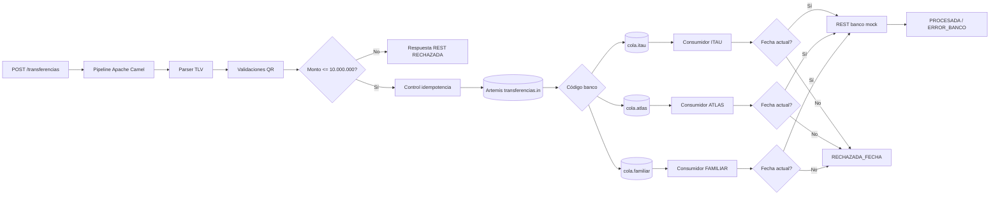

# Integración de transferencias SIP/QR V2 con Apache Camel, Artemis y REST

Proyecto educativo correspondiente a la **Tarea 2: Desarrollo de una solución de mensajería distribuida utilizando Apache ActiveMQ con patrones de enrutamiento, filtrado y procesamiento de mensajes**.

Esta versión parte de la Tarea 1 y conserva el parser TLV, el modelo canónico, las validaciones QR y el enrutamiento por entidad financiera. La evolución incorpora una API REST de entrada, Apache ActiveMQ Artemis mediante JMS, consumidores asíncronos, control de fecha, idempotencia y un banco simulado mediante WireMock.

> **Importante:** el proyecto es educativo. El checksum `A1B2` continúa siendo ficticio y no debe utilizarse para operaciones financieras reales.

## Objetivo

El flujo recibe una transferencia por HTTP `POST`, interpreta el QR, ejecuta las validaciones heredadas, controla el monto antes de publicar, evita duplicados por `id_transaccion`, publica la transferencia en Artemis y la enruta hacia una cola específica del banco. Cada consumidor valida la fecha y, si corresponde, realiza una llamada REST Request-Reply al banco mock.

## Tecnologías

- Java 17
- Apache Camel 4.18.3
- Apache ActiveMQ Artemis 2.44.0
- JMS Jakarta
- Maven
- Jackson JSON
- WireMock 3.13.2
- Docker Compose
- JUnit 5

## Arquitectura



También se incluye el diagrama provisto para la Tarea 2 en:

```text
/diagrama/flujo-tarea2.png
```

## Flujo

1. El cliente realiza `POST /transferencias` con `id_transaccion`, `fecha_transaccion`, `qr` y opcionalmente `monto`.
2. Apache Camel conserva los metadatos y procesa la cadena QR sin modificarla.
3. `QrParserProcessor` convierte TLV al modelo canónico `Transferencia`.
4. Para un QR estático, el campo `monto` de la petición puede completar el monto del modelo canónico.
5. Se ejecutan las validaciones heredadas de la Tarea 1.
6. Se controla que el monto sea menor o igual a `10.000.000`.
7. Se verifica que el `id_transaccion` no haya sido recibido antes.
8. La transferencia aceptada se publica como JSON en `transferencias.in`.
9. Un consumidor de entrada lee `transferencias.in` y enruta el mensaje por código de banco.
10. La transferencia se publica en `cola.itau`, `cola.atlas` o `cola.familiar`.
11. El consumidor bancario valida `fecha_transaccion` usando la zona horaria `America/Asuncion`.
12. Si la fecha es válida, se envía el modelo canónico al banco WireMock mediante REST.
13. La respuesta del mock se procesa y se registra un resultado final asociado al mismo `id_transaccion`.

## API REST de entrada

### URL

```text
POST http://localhost:8080/transferencias
```

### Headers

```http
Content-Type: application/json
```

### Petición

```json
{
  "id_transaccion": "TX000001",
  "fecha_transaccion": "2026-08-20",
  "qr": "00020101021232400014py.gov.bcp.sip01040015021012345678905204573153036005405150005802PY5910JUAN PEREZ6008ASUNCION6304A1B2",
  "monto": 15000
}
```

`monto` es opcional. Se utiliza principalmente para completar un **QR estático** que no contiene el tag `54`.

### Transferencia aceptada

HTTP `202`:

```json
{
  "id_transaccion": "TX000001",
  "estado": "ACEPTADA_PARA_PROCESAMIENTO",
  "mensaje": "Transferencia enviada a la cola"
}
```

La respuesta indica que el mensaje fue publicado para procesamiento asíncrono. No significa que el banco ya lo haya procesado.

### Rechazo por monto

Si el monto es mayor a `10.000.000`, el mensaje **no se publica en Artemis**.

```json
{
  "id_transaccion": "TX000002",
  "estado": "RECHAZADA",
  "mensaje": "El monto supera máximo permitido"
}
```

### Mensaje duplicado

HTTP `409`:

```json
{
  "id_transaccion": "TX-DUP-001",
  "estado": "DUPLICADA",
  "mensaje": "La transacción ya fue recibida anteriormente"
}
```

## Modelo publicado en Artemis

La cola recibe JSON y no objetos JMS serializados. El mensaje contiene el modelo canónico junto con los metadatos necesarios para el consumidor:

```json
{
  "id_transaccion": "TX000001",
  "fecha_transaccion": "2026-08-20",
  "transferencia": {
    "payload_format_indicator": "01",
    "point_of_initiation_method": "12",
    "merchant_account_information": {
      "globally_unique_identifier": "py.gov.bcp.sip",
      "codigo_entidad": "0015",
      "numero_cuenta": "1234567890"
    },
    "merchant_category_code": "5731",
    "transaction_currency": "600",
    "transaction_amount": 15000,
    "country_code": "PY",
    "merchant_name": "JUAN PEREZ",
    "merchant_city": "ASUNCION",
    "crc": "A1B2"
  }
}
```

## Colas Artemis

| Cola | Responsabilidad |
|---|---|
| `transferencias.in` | Cola principal para transferencias aceptadas por la API |
| `cola.itau` | Transferencias destinadas a ITAU (`0015`) |
| `cola.atlas` | Transferencias destinadas a ATLAS (`0007`) |
| `cola.familiar` | Transferencias destinadas a FAMILIAR (`0020`) |

La aplicación utiliza JMS únicamente en las rutas de integración. El parser, las reglas y el modelo canónico permanecen desacoplados del broker.

## Banco mock

WireMock se ejecuta en:

```text
http://localhost:8089
```

Apache Camel invoca:

```text
POST http://localhost:8089/banks/{BANCO}/transfer
```

Ejemplos:

```text
/banks/ITAU/transfer
/banks/ATLAS/transfer
/banks/FAMILIAR/transfer
```

El cuerpo de la petición es **solo el modelo canónico**. La correlación se envía mediante:

```http
X-Transaction-Id: TX000001
X-Bank: ITAU
```

Los stubs están en `wiremock/mappings/`.

- IDs normales → HTTP `200`.
- IDs que contienen `REJECT` o `ERROR` → HTTP `422`.
- IDs que contienen `FAIL` → HTTP `500`.

## Validación de fecha

El consumidor compara `fecha_transaccion` con la fecha actual utilizando:

```text
America/Asuncion
```

Si no coincide, no se invoca WireMock y el resultado es:

```json
{
  "id_transaccion": "TX000004",
  "estado": "RECHAZADA_FECHA",
  "mensaje": "La fecha_transaccion no coincide con la fecha actual ..."
}
```

## Idempotencia

`IdempotencyProcessor` utiliza un conjunto concurrente en memoria y toma `id_transaccion` como clave.

Esto implementa **Idempotent Receiver** para la práctica:

- primer `id_transaccion` → aceptado;
- segundo envío del mismo ID → `DUPLICADA`;
- el duplicado no se publica nuevamente en Artemis.

### Limitación

El almacenamiento es local en memoria. Se pierde cuando la aplicación se reinicia y no es compartido entre múltiples instancias. Para producción sería necesario un repositorio persistente/distribuido.

## Correlation Identifier

`id_transaccion` se conserva en:

- petición REST;
- JSON publicado en Artemis;
- header `JMSCorrelationID`;
- logs del consumidor;
- header REST `X-Transaction-Id` enviado al banco mock;
- resultado final.

Esto permite seguir una misma operación durante todo el flujo distribuido.

## Patrones EIP aplicados

### 1. Message Channel

Se utilizan dos tipos de canales:

**Internos:** rutas `direct:` utilizadas para separar parsing, validación, auditoría y procesamiento.

**Externos:** colas JMS de Artemis (`transferencias.in`, `cola.itau`, `cola.atlas`, `cola.familiar`) que desacoplan productores y consumidores.

### 2. Idempotent Receiver

`IdempotencyProcessor` rechaza un segundo mensaje con el mismo `id_transaccion` antes de publicarlo en Artemis.

### 3. Correlation Identifier

`id_transaccion` acompaña a la transferencia desde la API hasta el resultado final y también se utiliza como `JMSCorrelationID` y `X-Transaction-Id`.

### 4. Request-Reply

Cada consumidor aprobado realiza un `POST` al banco WireMock y espera su respuesta HTTP. La respuesta se analiza y se asocia con la transferencia original.

### Patrones heredados

También permanecen conceptos utilizados en la Tarea 1, entre ellos Pipes and Filters, Message Translator, Content-Based Router y Wire Tap.

## Manejo del monto

La regla de la Tarea 2 es:

```text
monto <= 10.000.000 -> permitido
monto >  10.000.000 -> rechazado
```

El mensaje de rechazo es exactamente:

```text
El monto supera máximo permitido
```

La evaluación se realiza antes de publicar en Artemis.

## Estructura principal

```text
sipap-camel-integration-v2/
├── pom.xml
├── docker-compose.yml
├── README.md
├── .env.example
├── scripts/
│   └── demo.ps1
├── diagrama/
│   └── flujo-tarea2.png
├── wiremock/
│   ├── mappings/
│   │   ├── 01-bank-rejected.json
│   │   ├── 02-bank-error.json
│   │   └── 10-bank-success.json
│   └── __files/
└── src/
    ├── main/java/py/com/ucom/sipap/
    │   ├── Application.java
    │   ├── domain/
    │   ├── exception/
    │   ├── processor/
    │   ├── route/
    │   └── util/
    └── test/java/py/com/ucom/sipap/
```

## Cómo ejecutar

### 1. Requisitos

- JDK 17+
- Maven 3.9+
- Docker Desktop con Docker Compose

Comprobar:

```powershell
java -version
mvn -version
docker --version
docker compose version
```

### 2. Levantar Artemis y WireMock

Desde la raíz:

```powershell
docker compose up -d
```

Verificar:

```powershell
docker compose ps
```

Consola web de Artemis:

```text
http://localhost:8161
```

Credenciales de desarrollo:

```text
Usuario: artemis
Contraseña: artemis
```

WireMock:

```text
http://localhost:8089/__admin/mappings
```

### 3. Ejecutar tests

```powershell
mvn clean test
```

### 4. Ejecutar Apache Camel

```powershell
mvn exec:java
```

La API queda disponible en:

```text
http://localhost:8080/transferencias
```

### 5. Ejecutar demostración automática

En otra terminal PowerShell:

```powershell
powershell -ExecutionPolicy Bypass -File .\scripts\demo.ps1
```

El script envía los escenarios requeridos y usa automáticamente la fecha actual del equipo.

## Pruebas mínimas cubiertas

| # | Escenario | Resultado esperado |
|---|---|---|
| 1 | REST válida con monto `<= 10.000.000` | Publicada en Artemis |
| 2 | Monto `> 10.000.000` | `RECHAZADA` antes del broker |
| 3 | Fecha igual a la actual | Consumidor continúa al mock |
| 4 | Fecha anterior | `RECHAZADA_FECHA`, sin invocar mock |
| 5 | Banco mock responde exitosamente | `PROCESADA` |
| 6 | Banco mock responde rechazo/error | `ERROR_BANCO` |
| 7 | Mismo `id_transaccion` dos veces | Segundo envío `DUPLICADA` |
| 8 | Correlación | Mismo ID en API, JMS, logs, mock y resultado |
| 9 | QR inválido o banco desconocido | `RECHAZADA`, no se encola |

## Ejemplo manual en PowerShell

Usar la fecha actual:

```powershell
$today = Get-Date -Format "yyyy-MM-dd"
```

Luego:

```powershell
$body = @{
    id_transaccion = "TX-MANUAL-001"
    fecha_transaccion = $today
    qr = "00020101021232400014py.gov.bcp.sip01040015021012345678905204573153036005405150005802PY5910JUAN PEREZ6008ASUNCION6304A1B2"
} | ConvertTo-Json

Invoke-RestMethod `
    -Method Post `
    -Uri "http://localhost:8080/transferencias" `
    -ContentType "application/json" `
    -Body $body
```

## Variables de entorno

| Variable | Default |
|---|---|
| `ARTEMIS_URL` | `tcp://localhost:61616` |
| `ARTEMIS_USER` | `artemis` |
| `ARTEMIS_PASSWORD` | `artemis` |
| `BANK_MOCK_BASE_URL` | `http://localhost:8089` |

Se incluye `.env.example` como referencia.
